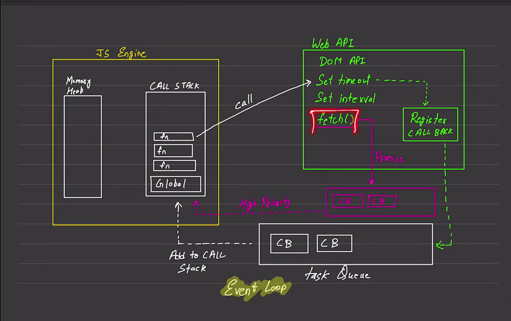
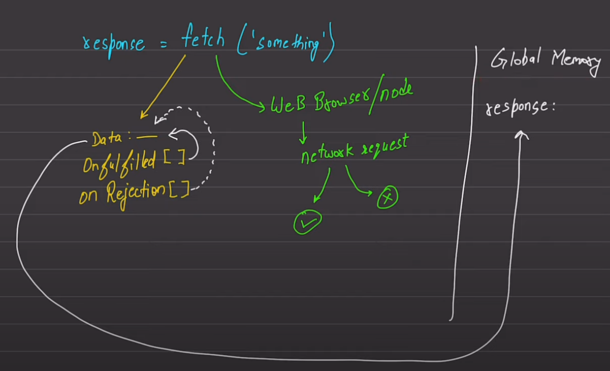

# JS-Basics
Learn JS

## Commands to get updated files without loosing previous  data

1. git remote add upstream `<original-assignment URL>`
2. git fetch upstream
3. git merge upstream/master
4. git rebase upstream/master
5. git push -f origin head

**Course resouces** - <https://github.com/hiteshchoudhary/js-hindi-youtube/tree/main>

**Async Javascript fundamentals**

**Working of Fetch**

---